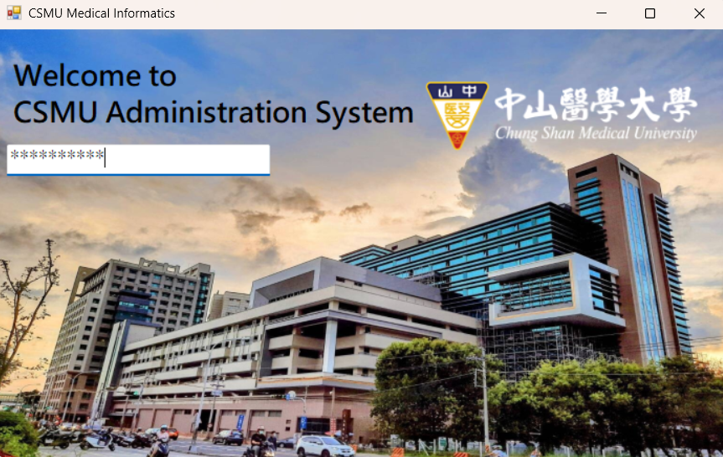
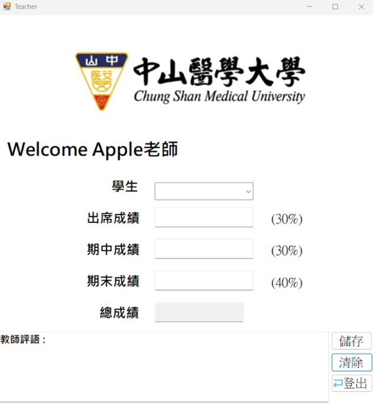
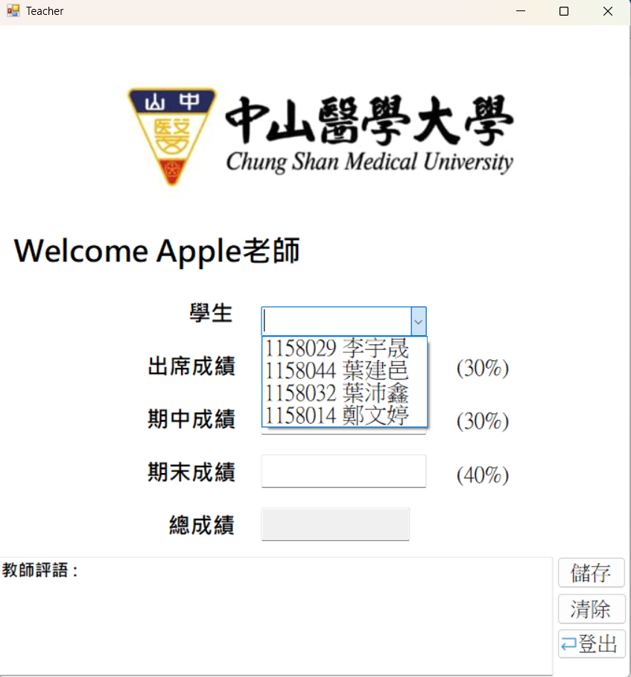
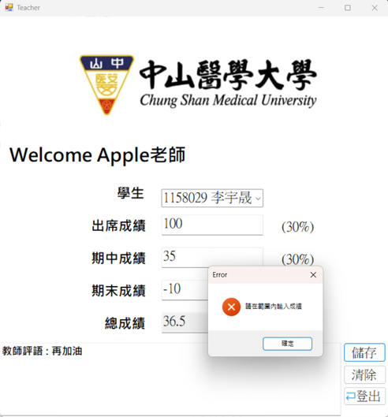
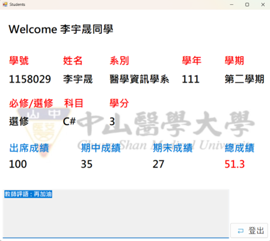

# 校務系統 (CSMU Administration System)

## 專案描述
這個專案是一個使用 C# 開發的校務系統，旨在取代傳統的帳號密碼登入方式，使用讀卡機讀取學生或教師身份，以提升便利性和安全性。系統分為學生端和教師端，學生可輕鬆查看成績，教師可方便輸入和修改學生成績。專案基於 .NET 框架，整合了表單 (Form) 間的資料同步和傳遞功能，解決了傳統校務系統的痛點，如忘記密碼或重複輸入。

(實際部署可能需考慮硬體相容性和安全漏洞。)

## 動機
作為學生的我們時常會覺得每次登入校務系統時，總需要一直輸入帳號密碼是件有些麻煩的事，如果能替換成讀卡機讀取，便能輕鬆的登入系統查看自己的成績，因此我們結合 .NET 上課所學的 C# 技巧，取代每次都需登入之過程，不僅能增加便利性，也能避免健忘的問題，並且讓老師們使用起來也能夠更加方便。

## 目的
讓學生能夠輕鬆查看成績，並協助教師們能夠更方便的使用學校校務系統登錄學生成績。

## 貢獻者及分工
- 1158014 鄭文婷 (學生端功能、整體系統串接)
- 1158029 李宇晟 (首頁功能、整體系統串接、Debug、資源提供)
- 1158032 葉沛鑫 (題目發想與架構設計、優化程式、Debug)
- 1158044 葉建邑 (老師端功能、Debug、整體系統串接)

## 安裝與執行
1. 需要 Visual Studio 或 .NET 開發環境(本專案使用.NET Framework 4.7.2)。
2. 開啟專案文件，編譯並執行主表單 (Home Form)。
3. 系統使用讀卡機輸入 ID (例如學生 ID 以 "1158" 開頭)，模擬登入。

## 代表性執行畫面
### 首頁 (Home)
歡迎畫面，輸入 ID 後導向學生或教師端。
- 畫面顯示：歡迎訊息、輸入框、學校背景圖。
 
 

	 
	 
<em>首頁範例畫面：輸入 ID 後的歡迎頁面與學校背景圖片。</em>

 

### 教師端 (Teacher)
教師可輸入學生成績，包括出席 (30%)、期中 (30%)、期末 (40%)，並儲存評語。
- 範例：選擇學生，填寫分數，按 "儲存" 或 "清除"。

 

	 
	 
	 
	 
<em>教師端範例畫面：選擇學生、輸入分數與儲存評語的操作介面。</em>

 

### 學生端 (Students)
學生查看個人成績，包括總分和教師評語。
- 範例：顯示科目分數、總分、評語。
 
 

	 
	 
<em>學生端範例畫面：學生查看個人成績與教師評語。</em>

 

